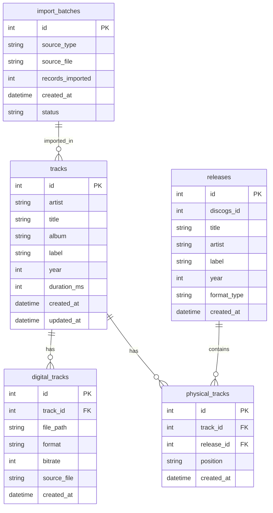

# ADR-001: Database Design for MusicTool

## Status
Accepted

## Context
We need to design a database schema to store music collection data from multiple sources:
- Digital tracks from Traktor NML files
- Physical releases from Discogs API/CSV
- Matching relationships between digital and physical formats
- Import history for incremental updates

## Decision
We will use SQLite with SQLAlchemy ORM for the following reasons:

### Database Choice: SQLite
- **Embedded**: No separate database server required
- **Zero configuration**: Works out of the box
- **Performance**: Sufficient for 3000+ tracks with proper indexing
- **Portability**: Single file database, easy to backup/restore

### ORM Choice: SQLAlchemy
- **Type safety**: Better integration with our pyright type checking
- **Migrations**: Built-in schema evolution support
- **Query builder**: Prevents SQL injection, improves maintainability
- **Relationships**: Clean handling of foreign keys and joins

### Schema Design Principles
1. **Normalized**: Separate concerns (tracks, formats, sources)
2. **Flexible**: Support for multiple digital/physical formats per track
3. **Auditable**: Track import history and changes
4. **Performant**: Appropriate indexes for common queries

## Schema Overview

## Consequences

### Positive
- Clean separation of concerns
- Supports fuzzy matching between digital/physical
- Efficient queries with proper indexing
- Easy to extend for future features
- Type-safe with SQLAlchemy models

### Negative  
- Slightly more complex than a flat table structure
- Requires understanding of relational concepts
- Need to manage foreign key relationships

### Mitigation
- Use Repository pattern to hide complexity
- Provide clear documentation and examples
- Add database initialization helpers
