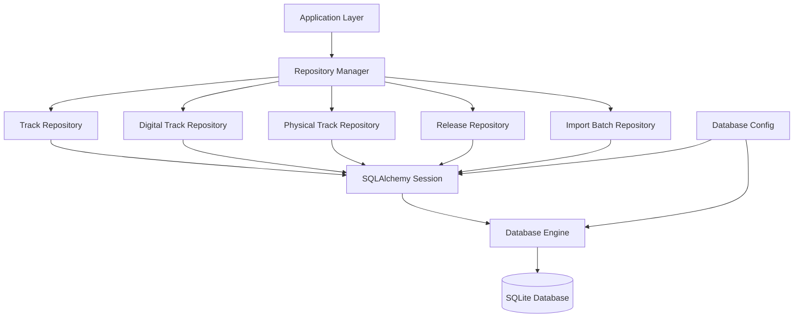

# ADR-002: Database Implementation with SQLAlchemy and Repository Pattern

## Status
Accepted

## Context
After defining the database schema in ADR-001, we need to implement the data access layer for the MusicTool application. The implementation should provide a clean abstraction over database operations, support proper transaction management, and be easily testable.

## Decision
We will implement the database layer using:

1. **SQLAlchemy ORM** - For object-relational mapping and database operations
2. **Repository Pattern** - For abstracting data access operations
3. **Database Configuration Manager** - For connection and session management
4. **Comprehensive Test Suite** - For ensuring reliability

## Implementation Details

### SQLAlchemy Models
Created models in `src/musictool/models/database.py`:
- **Track** - Core track entity with relationships to digital and physical formats
- **DigitalTrack** - Digital file information linked to tracks
- **PhysicalTrack** - Physical format information linking tracks to releases
- **Release** - Physical release information (albums, EPs, singles)
- **ImportBatch** - Audit trail for import operations

Key design decisions:
- Used modern SQLAlchemy 2.x declarative base
- Implemented cascade deletes for data integrity
- Added database indexes for performance
- Used proper foreign key relationships

### Repository Pattern
Implemented repository classes in `src/musictool/models/repositories.py`:
- **BaseRepository** - Abstract base with common CRUD operations
- **TrackRepository** - Track-specific queries including search and format filtering
- **DigitalTrackRepository** - Digital format queries
- **PhysicalTrackRepository** - Physical format queries  
- **ReleaseRepository** - Release information queries
- **ImportBatchRepository** - Import audit queries
- **RepositoryManager** - Manages all repositories for a session

Benefits:
- Encapsulates database logic
- Provides domain-specific query methods
- Enables easy testing with mock repositories
- Maintains separation of concerns

### Database Configuration
Created configuration management in `src/musictool/models/config.py`:
- **DatabaseConfig** - Manages engine and session creation
- Global initialization functions
- Context manager for transaction scope
- Support for different database URLs via environment variables

Features:
- Automatic table creation
- Transaction management with rollback on exceptions
- Configurable SQL debugging
- SQLite-specific optimizations

### Testing Strategy
Comprehensive test suite covering:
- **Model Tests** (`test_database_models.py`) - Model creation, relationships, cascades
- **Repository Tests** (`test_repositories.py`) - All repository methods and edge cases
- **Configuration Tests** (`test_database_config.py`) - Database setup and integration

Test approach:
- In-memory SQLite for fast, isolated tests
- Fixtures for consistent test data
- Transaction testing with rollback scenarios
- Integration tests for complete workflows

## Architecture

## Benefits

1. **Separation of Concerns** - Clear separation between business logic and data access
2. **Testability** - Easy to mock repositories for unit testing
3. **Maintainability** - Centralized database logic with clear interfaces
4. **Performance** - Proper indexing and query optimization
5. **Data Integrity** - Foreign key constraints and cascade operations
6. **Flexibility** - Easy to switch database backends or modify queries
7. **Transaction Safety** - Proper rollback handling on errors

## Trade-offs

### Advantages
- Clean architecture with proper abstractions
- Comprehensive test coverage
- Type safety with SQLAlchemy models
- Easy to extend with new query methods

### Disadvantages
- Additional abstraction layer (some prefer direct ORM usage)
- More initial setup complexity
- Potential performance overhead (minimal with proper caching)

## Configuration
- Database URL configurable via `DATABASE_URL` environment variable
- Defaults to `sqlite:///musictool.db` for local development
- SQL debugging enabled via `SQL_DEBUG=true` environment variable

## Migration Strategy
- SQLAlchemy metadata.create_all() for initial schema creation
- Future migrations can use Alembic if schema changes are needed
- Import batch tracking provides audit trail for data imports

## Consequences
- Database layer is ready for application development
- Clean foundation for import/export functionality
- Comprehensive test coverage ensures reliability
- Repository pattern enables easy mocking for higher-level tests
- Ready for integration with Streamlit UI and data import services

## Next Steps
1. Implement data import services (Traktor NML, Discogs API)
2. Create Streamlit UI components using the repository layer
3. Add data validation and business logic services
4. Implement search and filtering functionality
